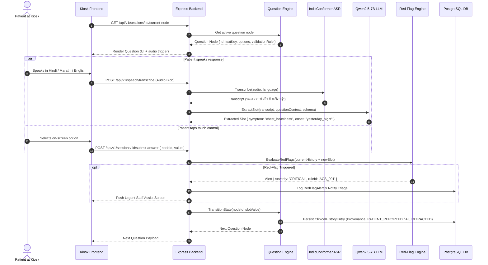
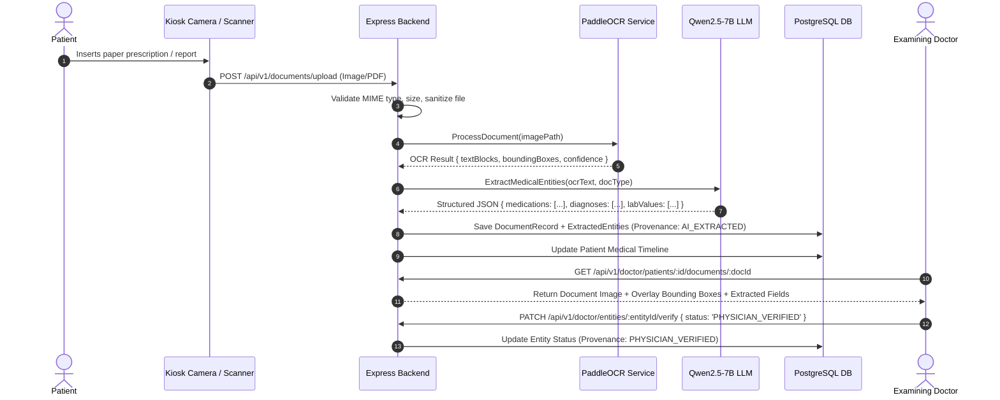

# System Architecture & Technical Design — MediKiosk

**Document Version:** 1.0.0 (Phase 0 Baseline)  
**Date:** September 2026  

---

## 1. Architectural Philosophy & Design Principles

MediKiosk is engineered as a **modular, resilient, and privacy-preserving clinical intake platform**. The architecture adheres to five foundational pillars:

1. **Separation of Clinical Intent from Conversational Execution:** The clinical question engine ("WHAT to ask") operates as a deterministic, state-driven workflow. The AI/LLM layer ("HOW to ask it") is an assistive translation and extraction layer.
2. **Zero-Trust AI Provenance:** Every piece of clinical data is tagged with its provenance (`PATIENT_REPORTED`, `AI_EXTRACTED`, `AI_NORMALIZED`, `PHYSICIAN_VERIFIED`) and confidence scores. AI outputs remain provisional drafts until signed off by a licensed doctor.
3. **Pluggable AI Abstraction Layer:** All AI capabilities (LLM, ASR, TTS, OCR) sit behind vendor-neutral TypeScript provider interfaces, isolating business logic from underlying inference engines and container runtimes.
4. **Deterministic Emergency Gating:** Red-flag triage decisions are executed by an auditable rule engine, never delegated to probabilistic LLM generative calls.
5. **On-Premise & Sovereign-Cloud Readiness:** Designed to operate self-contained within hospital edge servers or secure private cloud environments without mandatory external API dependencies.

---

## 2. High-Level System Architecture Diagram

```
+---------------------------------------------------------------------------------------------------+
|                                      PATIENT & CLINICIAN CLIENTS                                  |
|                                                                                                   |
|   +---------------------------------------------+   +-----------------------------------------+   |
|   |         Multimodal Kiosk Frontend           |   |            Doctor Dashboard             |   |
|   |  (React 18 + TS + Tailwind + Web Audio)     |   |   (React 18 + TS + Timeline & Review)   |   |
|   +---------------------------------------------+   +-----------------------------------------+   |
+------------------------------------------|----------------------------------------|---------------+
                                           | HTTPS / WSS / REST                     | HTTPS / REST
                                           v                                        v
+---------------------------------------------------------------------------------------------------+
|                                     MEDIKIOSK CORE BACKEND                                       |
|                                  (Node.js + Express.js + TS)                                      |
|                                                                                                   |
|   +-------------------------------------------------------------------------------------------+   |
|   | API Gateway & Middleware (JWT Auth, RBAC, Rate Limiting, Audit Logger, Input Sanitizer)    |   |
|   +-------------------------------------------------------------------------------------------+   |
|                                                                                                   |
|   +-------------------------------------------------------------------------------------------+   |
|   | Core Business Modules:                                                                    |   |
|   |  • Auth & Identity Module          • Consent Engine (DPDP/ABDM)   • Patient Session Module    |   |
|   |  • Clinical Question Engine        • AYUSH / Dashavidha Engine    • Document Management       |   |
|   |  • Deterministic Red-Flag Engine   • Clinical Summary Builder     • Timeline Synthesizer      |   |
|   |  • Doctor Verification Workflow    • FHIR / ABDM Adapter Layer                                |   |
|   +-------------------------------------------------------------------------------------------+   |
|                                                                                                   |
|   +-------------------------------------------------------------------------------------------+   |
|   | Data Access Layer (Prisma ORM with PostgreSQL + JSONB Schemas)                            |   |
|   +-------------------------------------------------------------------------------------------+   |
+------------------------------------------|--------------------------------------------------------+
                                           | Internal gRPC / Fast REST / UNIX Sockets
                                           v
+---------------------------------------------------------------------------------------------------+
|                                     AI SERVICES LAYER (SIDECARS)                                  |
|                                                                                                   |
|   +-----------------------+ +-----------------------+ +---------------------+ +-----------------+  |
|   | LLM Provider Adapter  | | ASR Provider Adapter  | | TTS Provider Adapter| |  OCR Provider   |  |
|   | (Qwen2.5-7B-Instruct) | | (IndicConformer)      | | (IndicF5)           | |  (PaddleOCR)    |  |
|   | [vLLM / Ollama]       | | [FastAPI / Triton]    | | [FastAPI / Triton]  | |  [Python API]   |  |
|   +-----------------------+ +-----------------------+ +---------------------+ +-----------------+  |
+---------------------------------------------------------------------------------------------------+
```

---

## 3. Component Breakdown

### 3.1 Frontend Subsystem (Single SPA / Multi-View Architecture)
- **Framework:** React 18 + TypeScript + Vite.
- **Styling & UI:** Tailwind CSS + Vanilla CSS micro-animations + Accessible Touch/Font scaling.
- **Kiosk Mode App:**
  - **Audio Recording Subsystem:** Web Audio API (`AudioWorklet` / `MediaRecorder`) for streaming PCM audio chunks to the backend.
  - **TTS Player:** HTML5 Audio player with visual waveform synchronization and text highlighter.
  - **Visual Question Renderer:** Dynamically renders questions from structured schemas (Single Choice, Multi Choice, Slider, Body Map, Number, Free Speech).
  - **Physical/Virtual Document Scanner UI:** Live camera preview, automated edge detection guidance, multi-page capture.
- **Doctor Dashboard App:**
  - **OPD Queue View:** Real-time patient triage status, wait times, red-flag badge indicators.
  - **Structured Case Review:** Accordion-based clinical summary matching conventional medical history formats.
  - **Dual-Pane Document Verifier:** OCR-extracted structured data on the left; original document with highlighted bounding boxes on the right.
  - **Interactive Medical Timeline:** Horizontally and vertically zoomable chronological canvas of all encounters, diagnoses, and lab results.

---

### 3.2 Backend Subsystem (Node.js + Express.js)

```
backend/
├── src/
│   ├── config/             # Environment, database, AI endpoints, logger config
│   ├── middleware/         # Auth, RBAC, rate-limiting, error-handler, audit-logger, upload
│   ├── routes/             # Express route declarations per domain
│   ├── controllers/        # Request handling, input validation parsing, HTTP responses
│   ├── services/           # Domain business logic (Session, QuestionEngine, Triage, Summary)
│   ├── repositories/       # Prisma ORM database queries & transaction handling
│   ├── models/             # Domain TypeScript interfaces and Prisma type extensions
│   ├── schemas/            # Zod validation schemas for all DTOs and API payloads
│   ├── modules/
│   │   ├── auth/           # Staff & Kiosk session authentication (JWT, Roles)
│   │   ├── patients/       # Patient demographic management & ABHA linking
│   │   ├── consent/        # DPDP/ABDM informed consent recording & audit logs
│   │   ├── question-engine/# State machine, adaptive graphs, question nodes
│   │   ├── clinical-history/# Clinical intake data aggregation & provenance tracking
│   │   ├── documents/      # File storage, secure URLs, thumbnailing, PDF splitting
│   │   ├── ocr/            # PaddleOCR integration & bounding box coordinate mapping
│   │   ├── ai/             # AI provider interfaces, LLM prompt templates, parsers
│   │   ├── red-flags/      # Deterministic rule engine, severity scoring, alerts
│   │   ├── timeline/       # Chronological event aggregator and normalizer
│   │   ├── summaries/      # Clinical narrative generator & verification tracker
│   │   ├── ayush/          # Dashavidha, Ashtavidha, Agni, Kostha, Prakriti engine
│   │   └── integrations/   # FHIR R4 resource mappers & mock ABDM gateway
│   ├── utils/              # Crypto, date helpers, file helpers, logger
│   ├── types/              # Common ambient TypeScript types and Enums
│   ├── app.ts              # Express application assembly and middleware registration
│   └── server.ts           # HTTP & WebSocket server bootstrap and graceful shutdown
├── prisma/
│   ├── schema.prisma       # Relational database schema & migrations
│   └── seed.ts             # Default admin, clinical question graphs, and red-flag rules
├── tests/                  # Unit, integration, and E2E test suites
├── Dockerfile
└── package.json
```

---

### 3.3 AI Service Sidecar Architecture

To ensure Node.js remains fast, lightweight, and non-blocking, heavy AI models run in isolated sidecar services (e.g., Python FastAPI / vLLM / Triton containers) communicating over localhost REST or gRPC:

| AI Service | Underlying Open-Source Engine | Node.js Abstraction Interface | Primary Responsibility |
| :--- | :--- | :--- | :--- |
| **LLM Service** | Qwen2.5-7B-Instruct (via vLLM / Ollama) | `ILLMProvider` | Speech semantic entity extraction, conversational phrasing, clinical summarization |
| **ASR Service** | AI4Bharat IndicConformer | `IASRProvider` | Multilingual speech-to-text (Hindi, Marathi, English) |
| **TTS Service** | AI4Bharat IndicF5 | `ITTSProvider` | Natural multilingual voice synthesis for kiosk prompts |
| **OCR Service** | PaddleOCR (PP-OCRv4) | `IOCRProvider` | Document layout analysis, text line recognition, table parsing |

---

## 4. End-to-End Data & Execution Flows

### 4.1 Conversational Turn Sequence (Audio/Touch Intake)



---

### 4.2 Document OCR & Structuring Sequence



---

## 5. Security & Isolation Boundaries

1. **Network Zone Isolation:**
   - Kiosk terminals communicate exclusively with the hospital edge server via a dedicated VLAN.
   - Doctor workstations communicate via authenticated hospital intranet TLS connections.
   - AI sidecars bind strictly to internal host loopback (`127.0.0.1`) or a secure Docker bridge network; no direct external exposure.
2. **Kiosk Ephemeral State Hygiene:**
   - Kiosk frontends maintain no persistent local storage of PHI (Protected Health Information).
   - Local audio/image buffers in frontend memory are purged immediately upon session completion or timeout (60s inactivity).
3. **Role-Based Access Control (RBAC):**
   - Four distinct system roles: `PATIENT_KIOSK_SESSION`, `TRIAGE_STAFF`, `DOCTOR`, and `SYSTEM_ADMIN`.

---

## 6. Scalability & Deployment Topologies

### 6.1 Single Hospital Edge Deployment (Standard OPD Kiosk Deployment)
- **Edge Node:** 1x On-Premise GPU Workstation (e.g., NVIDIA RTX 4090 / A5000 24GB VRAM) running:
  - Express.js Backend + PostgreSQL in Docker.
  - vLLM serving Qwen2.5-7B-Instruct (4-bit / 8-bit quantized: ~6–10GB VRAM).
  - IndicConformer ASR & IndicF5 TTS (4–6GB VRAM).
  - PaddleOCR CPU/GPU instance (<2GB VRAM).
- Handles up to 6–10 concurrent kiosk terminals with sub-second response times.

### 6.2 Multi-Kiosk Institutional Scale (Tertiary Hospital Tier)
- Centralized GPU Inference Node cluster running Triton Inference Server.
- Clustered Express.js API backend behind NGINX / HAProxy reverse proxy.
- PostgreSQL database configured with automated read replicas and daily encrypted backups.
